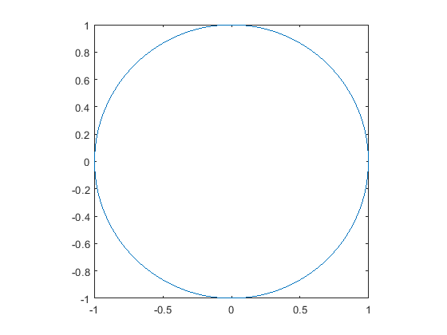
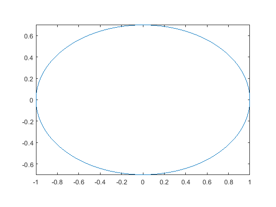
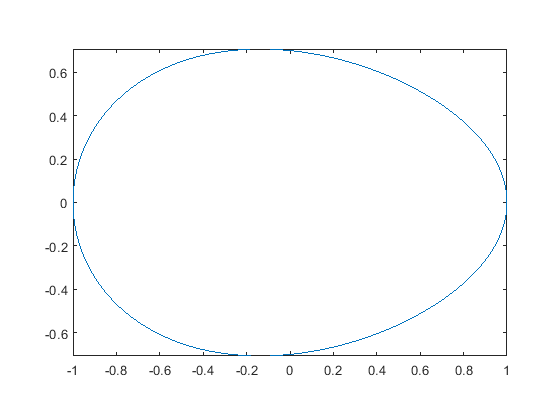
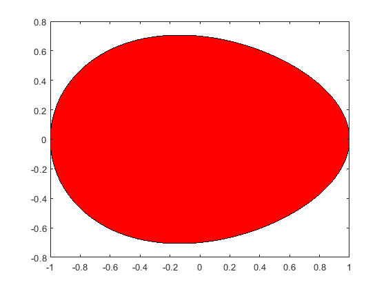
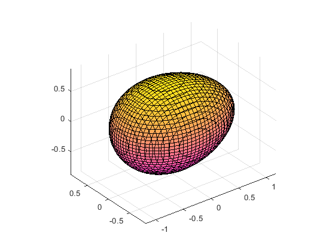

# Velikonoční vejce

Inspirace dle článku uvedeného zde:


[https://www.geoterra.eu/jirka-landa](https://www.geoterra.eu/jirka-landa)


Pro jednoduchost budeme u všech křivek v následujících příkladech nechávat střed vždy v bodě o souřadnicích [0,0].

# Kružnice

Vyjdeme nejprve z rovnice kružnice, kterou si můžeme snadno odvodit z Pythagorovy věty:

 $$ x^2 +y^2 =r^2 $$ 

Vykreslím si kružnici o poloměru r=1 pomocí funkce fimplicit.

```matlab
r = 1;
fk = @(x,y) x.^2 + y.^2 - r^2;
fimplicit(fk)
axis equal
```


# Elipsa

Vydělíme-li obě strany rovnice kružnice $r^2$ , dostaneme tuto rovnici ve tvaru:

 $$ {\left(\frac{x}{r}\right)}^2 +{\left(\frac{y}{r}\right)}^2 =1 $$ 

Kružnice je speciální případ elipsy pro a = b = r. Rovnice elipsy má tvar:

 $$ {\left(\frac{x}{a}\right)}^2 +{\left(\frac{y}{b}\right)}^2 =1 $$ 

Vykreslíme si elipsu pro a=1 a b=0.7.

```matlab
a = 1;
b = 0.7;
f = @(x,y) (x/a).^2 + (y/b).^2 - 1;
fimplicit(f)
axis equal
```


# Vejce 2D

Stejně jako v článku, na který se v úvodu odkazuji, nýní zobecníme rovnici elipsy tak, že parametr b, který značí velikost vedlejší poloosy elipsy, vyjádříme pomocí dvou parametrů b1 a b2. Přičemž pro speciální případ b1 = b2 obdržíme zase rovnici elipsy. Parametr b bude záviset na proměnné x tak, aby s rostoucím x přecházela křivka z tvaru sploštělého do špičatého, jak to u vejce očekáváme.


 $b=b_1 \cdot \frac{a-x}{2a}+b_2 \cdot \frac{a+x}{2a}$ ,


Vidíme, že pro $x=-a$ : $b=b_1$ , pro $x=a$ : $b=b_2$ .


Tedy rovnice vejce 2D:

 $$ {\left(\frac{x}{a}\right)}^2 +{\left(\frac{y}{b_1 \cdot \frac{a-x}{2a}+b_2 \cdot \frac{a+x}{2a}}\right)}^2 =1 $$ 
```matlab
a = 1;
b1 = 0.8;
b2 = 0.6;
f = @(x,y) (x/a).^2 + (y./(b1*(a-x)/2*a + b2*(a+x)/2*a)).^2 - 1;
fp = fimplicit(f);
axis equal
```



Můžeme si jej pomocí funkce `fill` ještě vybarvit:

```matlab
x = fillmissing(fp.XData,'linear');
y = fillmissing(fp.YData,'linear');
fill(x,y,'r')
```


# Vejce 3D

Chceme-li vykreslit vejce ve 3D, musíme 2D vejce nechat rotovat kolem osy x. Uvažujme tedy, že máme křivku *vejce 2D* v trojrozměrném prostoru. Na této křivce leží pro každé x z intervalu (-a,a) dva body se souřadnicemi [x, y0, 0] a [x,-y0, 0], kde:

 $$ {\left(\frac{x}{a}\right)}^2 +{\left(\frac{y_0 }{b_1 \cdot \frac{a-x}{2a}+b_2 \cdot \frac{a+x}{2a}}\right)}^2 =1 $$ 

Když necháme křivku rotovat kolem osy x, dostaneme díky rovnici kružnice pro každé x z intervalu (-a,a) množinu bodů se souřadnicemi [x,y,z], kde $y^2 +z^2 ={y_0 }^2$ . Dosazením do rovnice vejce 2D dostaneme rovnici vejce 3D:

 $$ {\left(\frac{x}{a}\right)}^2 +\frac{y^2 +z^2 }{{\left(b_1 \cdot \frac{a-x}{2a}+b_2 \cdot \frac{a+x}{2a}\right)}^2 }=1 $$ 
```matlab
a = 1;
b1 = 0.8;
b2 = 0.6;

f = @(x,y,z) (x/a).^2 + (y.^2+z.^2)./(b1*(a-x)/2*a + b2*(a+x)/2*a).^2 - 1;

fimplicit3(f)
axis equal
colormap spring
```


